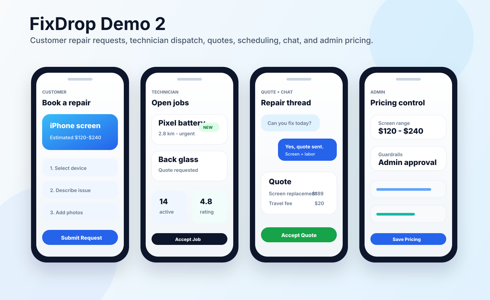

# FixDrop 5.2

<p align="center">
  
</p>

<p align="center">
  <strong>On-demand phone repair app with customer booking, technician dispatch, quotes, chat, scheduling, admin pricing, push notifications, calendar sync, and a local backend.</strong>
</p>

<p align="center">
  
</p>

## Correct Source Snapshot

This repository now points to the intended local project:

```text
/Users/vshnav/Downloads/FixDrop-5-2
```

That Downloads copy is newer than the earlier workspace folder I initially used. It includes May 5 App Review/account updates, app entitlements, push notification support, calendar sync, backend prompt docs, `FixDrop 3.zip`, the Xcode project, SwiftUI app source, and the Node/SQLite backend.

## Overview

FixDrop 5.2 is a full-stack repair-service prototype for handling phone repair requests from customer intake through technician completion. A customer submits a device issue, a technician reviews and accepts the request, quotes are generated, both sides coordinate through chat and scheduling, and an admin can manage pricing and technician operations.

## Product Highlights

- Customer-facing SwiftUI iPhone app
- Technician-facing workflow inside the same iOS app
- Admin views for repair operations and pricing control
- Multi-step repair request intake
- Device, issue, photo, location, and extra-detail collection
- Phone-number customer session flow
- Repair request tracking and status timeline
- Technician login and job acceptance
- Quote builder with line items and pricing guardrails
- Customer quote review and acceptance
- In-app chat tied to repair requests
- Scheduling and appointment coordination
- APNs device token handling and local notification support
- Calendar sync for confirmed repair appointments
- Node.js/Express backend with SQLite persistence
- Socket.io support for real-time repair chat rooms

## Repository Layout

```text
.
├── README.md
├── FixDrop/
│   ├── FixDropApp.swift
│   ├── ContentView.swift
│   ├── Info.plist
│   ├── FixDrop.entitlements
│   ├── Models/
│   ├── Services/
│   ├── Store/
│   └── Views/
├── FixDrop.xcodeproj/
├── backend/
│   ├── README.md
│   ├── package.json
│   ├── server.js
│   ├── db/
│   ├── middleware/
│   ├── routes/
│   └── services/
└── docs/
    └── assets/
```

## App Surfaces

| Surface | What it does |
|---|---|
| Customer App | Lets customers submit repair requests, review quotes, chat, schedule appointments, and view repair history. |
| Technician App | Lets technicians log in, review open jobs, accept repairs, create quotes, update job status, and coordinate with customers. |
| Admin Panel | Supports technician management, pricing configuration, quote guardrails, and repair oversight. |
| Backend API | Handles customer sessions, technicians, repairs, quotes, messages, appointments, pricing, and realtime events. |

## Backend Features

The backend is a local Node.js API server using Express, SQLite, JWT authentication, and Socket.io.

Main route areas:

- `POST /api/auth/customer/session`
- `POST /api/auth/technician/login`
- `GET /api/repairs`
- `POST /api/repairs`
- `GET /api/repairs/open`
- `PATCH /api/repairs/:id/accept`
- `PATCH /api/repairs/:id/status`
- `GET /api/quotes`
- `POST /api/quotes`
- `PATCH /api/quotes/:id/accept`
- `GET /api/messages`
- `POST /api/messages`
- `GET /api/technicians`
- `GET /api/pricing`
- `PUT /api/pricing`
- `POST /api/appointments`

## Tech Stack

| Layer | Technology |
|---|---|
| iOS App | Swift, SwiftUI, Combine, UIKit, EventKit, UserNotifications |
| Backend | Node.js, Express, Socket.io |
| Database | SQLite with `better-sqlite3` |
| Auth | JWT for technician/admin access, phone-based customer session |
| Realtime | Socket.io repair chat rooms |
| Local Dev | Xcode + local backend on port `3001` |

## Running The Backend

```bash
cd backend
npm install
npm run dev
```

The local server runs at:

```text
http://localhost:3001
```

## Running The iOS App

Open:

```text
FixDrop.xcodeproj
```

The app source is in `FixDrop/` and uses the backend/API configuration in `FixDrop/Services/PricingService.swift` and the store/networking layer in `FixDrop/Store/RepairStore.swift`.

## Portfolio Notes

This repo is organized for employers and reviewers to understand the product, architecture, and implementation work. It excludes generated build outputs, `.DS_Store`, local databases, secrets, and machine-specific state.

The visual images in this README are polished SVG previews created for GitHub presentation, based on the actual implemented flows: request intake, technician dashboard, chat/quotes, and admin pricing.
